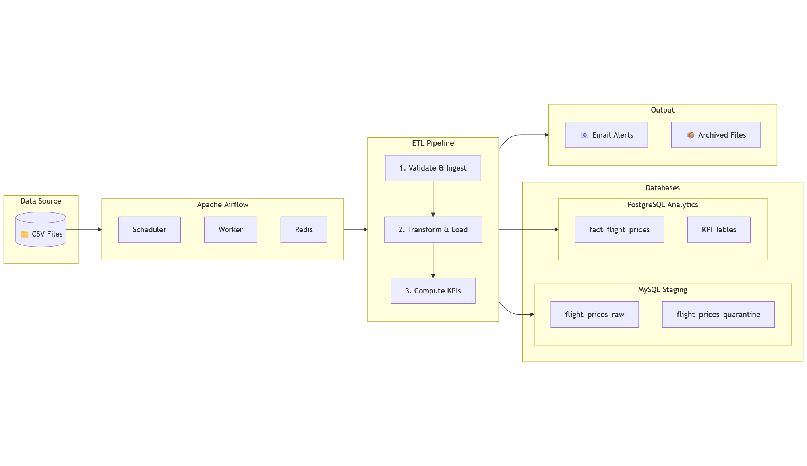

# Flight Price Analysis Pipeline

An end-to-end data engineering pipeline for analyzing Bangladesh flight price data using Apache Airflow.



## Overview

This pipeline automates the ETL process for flight price data:
- **Validates data before ingestion** (validate-first approach)
- **Auto-discovers unprocessed datasets** from the data folder
- **Prevents duplicates** with upsert logic
- **Archives processed files** automatically
- **Sends email alerts** for validation summaries and critical failures
- **Computes KPIs in parallel** for analytics

## Tech Stack

| Component | Technology |
|-----------|------------|
| Orchestration | Apache Airflow 3.x (CeleryExecutor) |
| Staging DB | MySQL 8.0 |
| Analytics DB | PostgreSQL 16 |
| Message Broker | Redis 7 |
| Containerization | Docker & Docker Compose |
| Data Processing | Python 3.11, Pandas, SQLAlchemy |

## Architecture

### Pipeline Flow

```
CSV Files → Validate & Ingest → Transform & Load → Compute KPIs (Parallel)
    ↓              ↓                    ↓                   ↓
 Archive     MySQL Staging      PostgreSQL Analytics    KPI Tables
              (raw + quarantine)    (fact table)
```

### Data Flow

1. **Validate & Ingest**: Reads CSV, validates records in-memory, upserts valid records to staging, quarantines invalid ones
2. **Transform & Load**: Enriches data with computed fields and loads to analytics
3. **Compute KPIs**: Runs 4 parallel tasks to calculate business metrics

## Project Structure

```
├── dags/                          # Airflow DAG definitions
│   ├── flight_price_analysis_dag.py
│   ├── init_staging_schema.py
│   └── init_analytics_schema.py
├── scripts/
│   ├── tasks/                     # Pipeline task modules
│   │   ├── validate_staging_data.py
│   │   ├── transform_and_load.py
│   │   └── compute_kpis.py
│   └── utils/                     # Utility modules
│       ├── dataset_tracker.py     # Auto-discovery & archiving
│       ├── csv_reader.py          # CSV reading & preprocessing
│       ├── data_validator.py      # Validation rules
│       ├── db_operations.py       # Database upsert operations
│       └── email_notifications.py # Email alerts (SMTP)
├── sql/
│   ├── staging/                   # MySQL table definitions
│   └── analytics/                 # PostgreSQL table & KPI queries
├── data/                          # Source CSV files
│   └── archived/                  # Processed files moved here
├── docker-compose.yml
├── Dockerfile
└── .env                           # Environment configuration
```

## Quick Start

### 1. Configure Environment

Copy and edit the environment file:
```bash
cp .env.example .env
# Edit .env with your SMTP credentials for email alerts
```

### 2. Start Services

```bash
docker-compose up -d
```

### 3. Initialize Schemas (First Run Only)

Open Airflow UI at http://localhost:8080 and trigger:
1. `init_staging_schema`
2. `init_analytics_schema`

### 4. Run the Pipeline

Trigger `flight_price_analysis_bangladesh` DAG.

## KPIs Computed

| KPI | Description |
|-----|-------------|
| Average Fare by Airline | Mean ticket price per airline |
| Seasonal Variation | Price trends by season and peak periods |
| Booking Count by Airline | Flight volume per carrier |
| Top Routes | Most popular routes by booking count |

## Features

### Validate-First Approach
Data is validated in-memory before any database insert. Invalid records go to quarantine, valid records are upserted to staging.

### Duplicate Prevention
Uses `INSERT ON DUPLICATE KEY UPDATE` with unique constraint on `(file_name, source_row_number)` to prevent duplicate data.

### Auto-Discovery & Archiving
- Automatically finds new CSV files in `/data` folder
- Processed files are moved to `/data/archived` with timestamp suffix

### Email Notifications
- Sends validation summary after each run
- Sends critical alerts when >90% of records fail validation
- Uses direct SMTP (Gmail compatible)

## Environment Variables

Key variables in `.env`:

```bash
# Database
MYSQL_DATABASE=staging_db
ANALYTICS_POSTGRES_DB=analytics_db

# Email Alerts
AIRFLOW__SMTP__SMTP_HOST=smtp.gmail.com
AIRFLOW__SMTP__SMTP_PORT=587
AIRFLOW__SMTP__SMTP_USER=your-email@gmail.com
AIRFLOW__SMTP__SMTP_PASSWORD=your-app-password
ALERT_EMAIL_RECIPIENTS=alerts@yourcompany.com
```

## Useful Commands

```bash
# Start services
docker-compose up -d

# Stop services
docker-compose down

# View logs
docker-compose logs -f airflow-worker

# Restart worker after code changes
docker-compose restart airflow-worker

# Access Adminer (DB UI)
# http://localhost:8081
```

## Ports

| Service | Port |
|---------|------|
| Airflow UI | 8080 |
| Adminer | 8081 |
| MySQL | 3307 |
| PostgreSQL (Analytics) | 5434 |

---

**Author**: Daniel Agudey Doe  
**Last Updated**: February 2026
